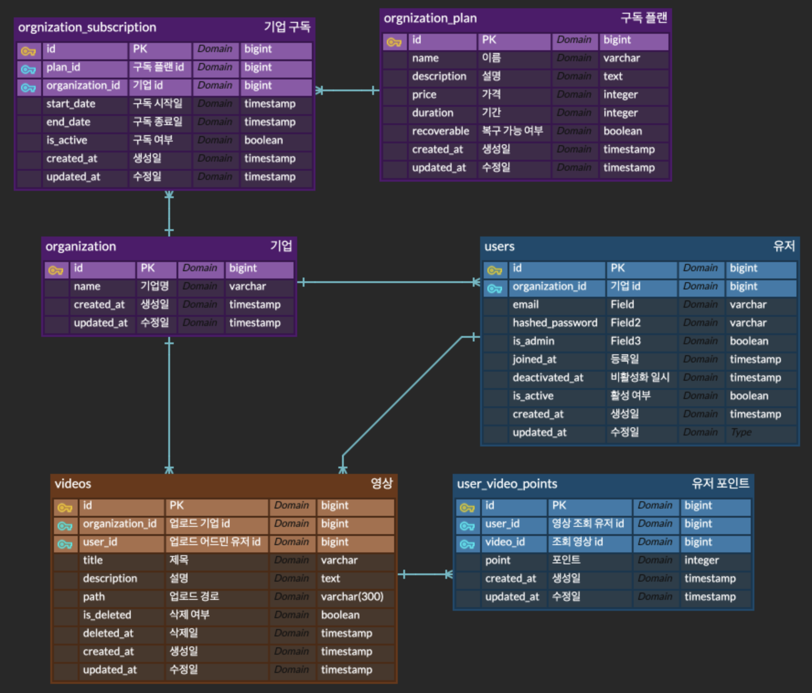

# 동영상 플랫폼

## 주요 기술 스택
- **FastAPI**: 비동기 기반 웹 프레임워크
- **SQLAlchemy + Alembic**: ORM 및 DB 마이그레이션
- **Redis**: 
  - Celery 브로커 및 Beat 스케줄러로 사용
  - 영상 조회 포인트 적립 시 **분산락(Distributed Lock)** 구현에 활용
- **Celery + Redis**: 비동기 작업 처리 및 스케줄링
  - `Celery Beat`로 유료 구독 만료 스케줄 작업 자동화
- **PostgreSQL**: 관계형 데이터베이스
- **Pydantic v2**: 스키마 정의 및 검증
- **Docker Compose**: 서비스 통합 실행


## ERD
기업 단위로 사용자와 동영상 관리하고, 유로 구독 플랜에 따라 기능을 제한하거나 확장 할 수 있는 구조로 설계하였습니다.


### 기업 및 사용자 관리
- **organization**: 기업 단위 정보
- **users**: 조직 소속 사용자 정보 
  - 하나의 조직에 여러 명의 유저가 있습니다. 
  - 이메일은 조직 내에서 유일합니다.
- **organization_plan**: 기업이 선택할 수 있는 구독 플랜 정보 
  - 가격, 기간, 삭제 복구 여부 등을 포함합니다.
- **organization_subscription**: 조직의 실제 구독 정보
  - 유료/무료 플랜 여부, 구독 기간을 기록하며, 활성 플랜은 하나만 유지 됩니다.

### 동영상 및 포인트 시스템
- **videos**: 유저가 업로드한 동영상 정보
  - 유저와 조직에 모두 종속되며, soft delete 기능을 지원합니다.
- **user_video_point**: 유저가 특정 영상을 조회했을 때 적립되는 포인트 정보
  - 유저와 비디오의 다대다 관계를 포인트 기록으로 관리합니다.

## 프로젝트 구조
각 모듈은 Service-Repository 패턴으로 설계했으며, `routers.py`, `schemas.py`, `models.py`, `service.py`, `repository.py` 파일로 구성되어 있습니다.
```shell
.src/
├── auth/           # 인증 및 권한 관리
├── user/           # 유저 관리 및 포인트 적립
├── organization/   # 기업, 구독 플랜 및 유료 플랜 관리
├── video/          # 영상 등록/수정/삭제 및 조회 처리
├── core/           # 환경 설정, 예외, Celery 등 공통 로직
├── db/             # 세션 및 마이그레이션 설정
└── main.py         # FastAPI 앱 엔트리포인트

```

## 환경 설정 및 서버 구동
- `poetry`를 사용하여 python 패키지 및 가상환경을 관리합니다.
- SQLAlchemy ORM 모델의 변경 사항을 DB에 반영하기 위해 `Alembic`를 사용하였습니다.
- `.env`를 통해 환경 변수를 설정하였습니다.

### Docker 기반 전체 서비스 실행
- FastAPI 앱, PostgreSQL, Redis, Celery를 포함한 전체 스택을 docker-compose로 한 번에 실행합니다.
```shell
docker compose up --build -d
```

### swagger API 테스트
docker 기반으로 서버 실행 후 swagger UI에서 API 문서 확인할 수 있습니다. 
- [swagger docs](http://0.0.0.0/docs)


## 구현 기능
### Auth
- JWT 기반 로그인

### User
- 일반 유저
  - 내 정보 비밀번호 변경
  - 계정 탈퇴(soft delete)
- 어드민
  - 유저 생성 (조직 내에만 생성 가능)
  - 유저 수정 (비밀번호, 권한 변경)
  - 유저 삭제 (조직 내 유저만 삭제 가능)

### Organization
- 기업 생성
  - 기업 어드민 계정 자동 생성
  - 무료 구독 플랜 자동 적용
- 유료 구독 전환 (어드민 전용)
  - 구독 플랜 변경 및 구독 만료 처리
  - 결제 완료 이후 실행 되는 전제 가정
- 유료 구독 만료 처리
  - `celery beat`를 통한 주기적 스케줄 작업으로 만료 구독 자동 비활성화

### Video
- 일반 유저
  - 영상 조회
    - 영상 스트리밍 응답 제공
    - 조회 시 포인트 적립
    - `Redis` 분산 락을 활용한 포인트 적립 동시성 제어
    - 관련 코드는 `src.user.service.add_user_video_point_with_lock()`에 구현
- 어드민
  - 영상 등록
    - 파일 업로드 시 `celery`를 통한 비동기 작업
  - 영상 수정
    - 파일 유무에 따라 처리 분기
  - 영상 삭제
    - soft delete로 방식 적용
  - 영상 복구
    - 유료 플랜 조직만 복구 가능
